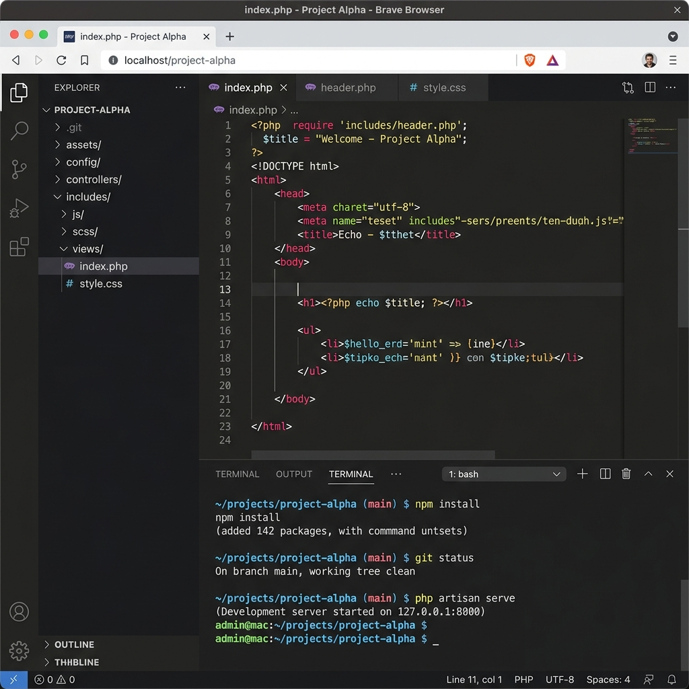
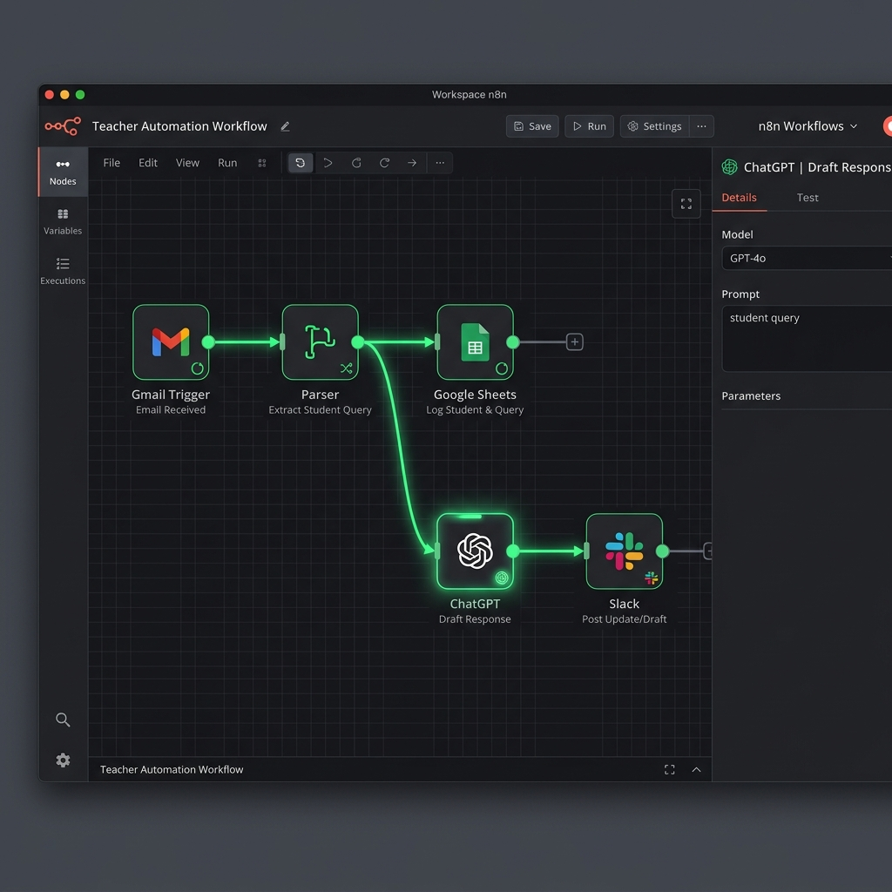

# 🚀 Guía de Productividad y Tecnologías: Especial Docencia
### Preparado para: Prof. Loles
**Objetivo:** Transformar la gestión académica diaria mediante la automatización y el uso estratégico de herramientas cloud para recuperar tiempo de calidad docente.

---

## 🛠️ 1. Las Tecnologías (El "Kit" de Herramientas)

### 1.1 GitHub & Codespaces: Tu centro de mando en la nube
No es solo para programadores. Para ti, es una forma de tener tu material siempre listo:
*   **Repositorios:** Carpetas inteligentes para tus apuntes, enunciados y plantillas de exámenes.
*   **Codespaces:** Un entorno de trabajo que se abre en el navegador en 5 segundos. Puedes corregir tareas o probar aplicaciones web de alumnos sin instalar nada en tu ordenador personal.

### 1.2 n8n: Tu asistente personal 24/7
Es el "pegamento" que conecta tus herramientas (Gmail, Google Sheets, Telegram, Drive). n8n trabaja mientras tú das clase, moviendo datos de un sitio a otro según tus reglas.

---

## 🤖 2. Casos de Uso Prácticos (Para tu día a día)

### 2.1 Optimización y Triaje de Correo Administrativo e Institucional
Como docente, tu bandeja de entrada se inunda de correos institucionales, convocatorias de reuniones, actas de departamento, boletines y peticiones de secretaría:
*   **Clasificación Inteligente:** Un flujo de n8n puede leer tus correos entrantes de Gmail u Outlook corporativo. Si provienen del equipo directivo, secretaría o jefatura de estudios, n8n los clasifica por orden de prioridad, les asigna una etiqueta de color automática y crea una tarea en tu gestor (ej. Todoist o Google Tasks) con el plazo correspondiente para que nunca se te pase un trámite.
*   **Resumen Diario de Alertas:** En lugar de interrumpir tus clases o tutorías revisando el correo constantemente, n8n puede recopilar todos los correos institucionales de menor urgencia recibidos durante la mañana y enviarte un único **resumen diario por Telegram o WhatsApp** a la hora que elijas, consolidando las novedades administrativas importantes y los próximos eventos del calendario.

### 2.2 Detección de IA y Plagio en Exámenes de Código
Si tus alumnos usan IA (ChatGPT, Copilot) para resolver los exámenes prácticos de IAW o Lenguaje de Marcas:
*   **Filtro n8n + AI:** Puedes crear un flujo donde n8n reciba el código del examen y lo envíe a un modelo de lenguaje (como GPT-4) pidiéndole: *"Analiza este código e identifica patrones típicos de generación por IA o inconsistencias con el nivel de la clase"*.
*   **Análisis de Historial (GitHub):** En lugar de solo ver el resultado final, puedes ver el **historial de commits**. Si un alumno tiene 500 líneas de código perfectas subidas de golpe en un solo commit, es una señal clara de "copiar y pegar".
*   **Auditoría en Tiempo Real (Codespaces):** Al usar Codespaces, puedes entrar en vivo en la sesión del alumno (Live Share) para ver cómo construye la lógica paso a paso, o revisar el historial de comandos ejecutados en la terminal.

> ⚠️ **IMPORTANTE - Nota sobre Equidad:** Estas herramientas deben servir como **orientación**, no como juez único. Es vital mantener la revisión humana para evitar falsos positivos y asegurar que la tecnología fomente el aprendizaje honesto sin crear un clima de vigilancia punitiva.

### 2.3 Gestión Automática de Tutorías
*   **El Flujo:** En lugar de hilos interminables de correos, n8n conecta tu calendario con un formulario. El alumno elige hueco, n8n crea la cita, genera el enlace de la reunión (Meet/Teams) y os envía el recordatorio a ambos.

---

## 🔐 3. Seguridad y Privacidad: El Protocolo MPC

En el ámbito docente manejas datos extremadamente sensibles (DNI, expedientes, salud). El **Multi-Party Computation (MPC)** es tu aliado invisible:

*   **¿Cómo te ayuda?:** Permite realizar cálculos sobre datos de alumnos (ej. estadísticas de aprobados por zona o becas) sin que nadie (ni el informático, ni la plataforma cloud) pueda ver el contenido real de los datos.
*   **Privacidad por Diseño:** Te permite cumplir con la **RGPD** de forma matemática. Podrías comparar tus notas con las de otros centros para ver el nivel medio sin que ningún centro exponga las notas de sus alumnos individuales.

---

## 📚 4. Recursos de Aprendizaje y Cursos Recomendados

Para ayudarte a dominar estas herramientas a tu propio ritmo, te recomendamos los siguientes cursos y recursos formativos 100% gratuitos y prácticos:

### 🐙 Dominando GitHub y Codespaces
*   **[GitHub Skills (Oficial)](https://skills.github.com/)**: La plataforma interactiva oficial de GitHub. Aprende a crear repositorios, gestionar ramas y configurar Codespaces a través de retos prácticos guiados paso a paso. *(Recomendado para docentes: Curso "Introduction to GitHub")*.
*   **[GitHub para la Educación (GitHub Education)](https://education.github.com/)**: Recursos exclusivos para profesores. Descubre cómo automatizar la entrega de tareas escolares mediante **GitHub Classroom**.

### ⚡ Automatizaciones con n8n
*   **[n8n Academy (Oficial)](https://academy.n8n.io/)**: Cursos gratuitos estructurados en niveles (Principiante, Intermedio, Avanzado) con exámenes y certificaciones. Te guiarán desde la instalación del flujo más sencillo hasta la manipulación compleja de datos y APIs.
*   **[Plantillas de Flujos de n8n para Educación](https://n8n.io/workflows/)**: Galería de automatizaciones prediseñadas que puedes clonar en tu espacio de trabajo con un solo clic (ej. alertas de Gmail, backups en Drive).

### 🤖 Inteligencia Artificial aplicada a la Docencia
*   **[Guía de Integración Avanzada OpenAI + n8n](https://docs.n8n.io/integrations/builtin/credentials/openai/)**: Documentación oficial y tutoriales para conectar modelos como GPT-4 a tus flujos diarios para triaje de correos o análisis de plagios de código.
*   **[Google AI Essentials (Coursera)](https://www.coursera.org/learn/google-ai-essentials)**: Un curso introductorio y de productividad excelente para entender cómo diseñar prompts eficientes para tareas administrativas de clase.

---

## 💡 Tu Nueva Rutina
1.  **Centraliza** tus materiales en GitHub.
2.  **Automatiza** el filtrado de tus correos y dudas con n8n.
3.  **Delega** la vigilancia del plagio y la agenda a flujos de trabajo inteligentes.

---

> [!TIP]
> **Consejo Final:** No intentes automatizarlo todo a la vez. Elige la tarea que más te quita el sueño (ej. "los correos de dudas") y empieza por ahí. La tecnología debe trabajar para ti, no al revés.
